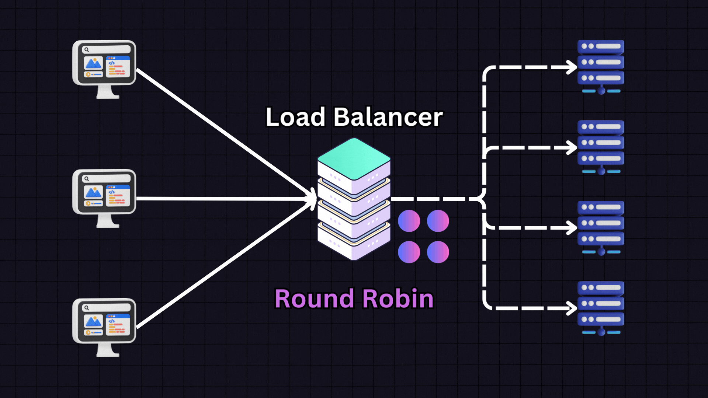

# load-balancer

**A simple HTTP load balancer in Go using round-robin algorithm**.



## Features

- Round-robin load balancing with atomic operations
- Reverse-proxy
- Context-based timeout handling
- HTTP connection pooling for performance
- Graceful shutdown support
- Request streaming for memory efficiency
- Structured logging with latency metrics

## Quick Start

1. **Clone the repository**:

```bash
git clone https://github.com/extndr/load-balancer.git
cd load-balancer
```

2. **Start demo backends and load balancer**:

```bash
cd demo
docker-compose up -d
```

3. **Test the load balancer**:

```bash
curl http://localhost:8080
# Expected output cycles between:
# Backend 1
# Backend 2
# Backend 3
```

4. **Configuration**

Create a .env file in the project root if you want to change the port or backend URLs (not demo), for example:

```bash
PORT=8080
BACKENDS=http://backend1:5678,http://backend2:5678,http://backend3:5678
```

## Upcoming enhancements

- Health checks and circuit breaker pattern
